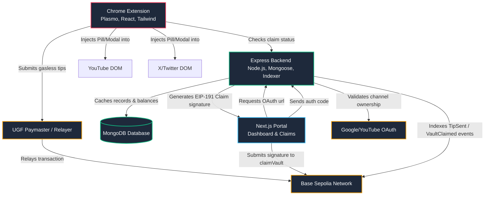

# 🔗 TipChain

[]()
[]()
[]()

> Turning any creator on the internet into a tip-able on-chain destination. TipChain injects gasless crypto tipping directly into the platforms you browse, like YouTube and X.

---

## 📖 Overview

**TipChain** is a decentralized tipping platform built for the Base Sepolia network. It bridges Web2 creator platforms with Web3 funding, allowing fans to tip creators in cryptocurrency without needing gas (using the User Gas-free Flow - **UGF** protocol). 

### The Problem
Traditional creator platforms have fragmented monetization (subscriptions, Patreon, Buy Me a Coffee links). While Web3 wallets enable direct, borderless micropayments, they introduce high friction: manual wallet configurations, network switching, gas estimation, and confusing UX.

### The TipChain Solution
1. **Contextual Injected UI**: A Chrome extension dynamically displays a sleek **"Tip" pill** next to creator handles on YouTube and X/Twitter.
2. **Frictionless Payments**: Users can trigger a gasless tip in a glassmorphic checkout modal using a connected wallet. Gas is covered seamlessly via the UGF paymaster.
3. **Verified Claims**: Creators log in with Google OAuth to verify ownership of their social handles and cryptographically claim accrued tips directly to their Web3 wallets.

---

## 🏗️ System Architecture



---

## 🌟 Key Features

*   **Injected Web2 Integration**: Content scripts monitor YouTube owner sections and X/Twitter profile elements, injecting a glassmorphic tipping UI.
*   **Gas-Free Transactions**: Tipping uses the `@tychilabs/ugf-testnet-js` package on Base Sepolia, abstracting gas management away from the fan.
*   **OAuth Channel Claims**: Creators prove channel ownership using Google OAuth. Once authenticated, the backend generates an EIP-191 signature, which creators use to claim accumulated tips from the smart contract.
*   **Real-time Event Indexer**: A background service listens for on-chain events (`tipAndMint` and `VaultClaimed`) on Base Sepolia, updating the cache database for instant dashboard updates.

---

## 📂 Project Structure

```text
Tip-Chain/
├── tipChain-extension/    # Plasmo chrome extension injected into YouTube & X
├── tipChain-frontend/     # Next.js web application for dashboard, claims, and marketplace
└── tipChain-backend/      # Express API server & on-chain event indexer
```

---

## 🔧 Installation & Setup

### Prerequisites
*   [Node.js](https://nodejs.org/) (version 18 or higher)
*   [MongoDB](https://www.mongodb.com/) (Local instance or MongoDB Atlas URI)
*   Chrome Browser (for extension testing)

---

### 1. Setup the Backend API & Indexer
The backend acts as the caching database, OAuth handler, and event listener.

1. Navigate to the backend directory:
   ```bash
   cd tipChain-backend
   ```
2. Install dependencies:
   ```bash
   npm install
   ```
3. Create a `.env` file in the root of `tipChain-backend`:
   ```env
   PORT=8000
   CORS_ORIGINS=*
   FRONTEND_URL=http://localhost:3000
   MONGO_URI=your-mongodb-connection-string
   JWT_SECRET=your-jwt-signing-secret
   BASE_SEPOLIA_RPC_URL=wss://base-sepolia.g.alchemy.com/v2/your-alchemy-key
   SERVER_PRIVATE_KEY=your-server-wallet-private-key # EOA that signs claim approvals
   GOOGLE_CLIENT_ID=your-google-oauth-client-id
   GOOGLE_CLIENT_SECRET=your-google-oauth-client-secret
   GOOGLE_REDIRECT_URI=http://localhost:8000/api/claim/oauth-callback
   ```
4. Start the server (development mode with Nodemon):
   ```bash
   npm run dev
   ```

---

### 2. Setup the Chrome Extension (Plasmo)
The extension handles page DOM injection and user wallet integration for sending gasless tips.

1. Navigate to the extension directory:
   ```bash
   cd tipChain-extension
   ```
2. Install dependencies:
   ```bash
   npm install
   ```
3. Create a `.env` file in the root of `tipChain-extension`:
   ```env
   PLASMO_PUBLIC_API_URL=http://localhost:8000
   ```
4. Start the hot-reloading development server:
   ```bash
   npm run dev
   ```
5. Load the extension in Google Chrome:
   - Go to `chrome://extensions`
   - Toggle **Developer Mode** on (top right)
   - Click **Load unpacked**
   - Select the `build/chrome-mv3-dev` directory generated by Plasmo.

---

### 3. Setup the Frontend Portal (Next.js)
The frontend houses the creator claims portal, user dashboard, and creator marketplace.

1. Navigate to the frontend directory:
   ```bash
   cd tipChain-frontend
   ```
2. Install dependencies:
   ```bash
   npm install
   ```
3. Create a `.env` file in the root of `tipChain-frontend`:
   ```env
   NEXT_PUBLIC_API_URL=http://localhost:8000
   NEXT_PUBLIC_DEMO_HANDLE=synthwave_sarah
   ```
4. Start the local development server:
   ```bash
   npm run dev
   ```
5. Open `http://localhost:3000` in your web browser.

---

## 🛠️ Technologies Used

| Layer | Technologies / Libraries |
| :--- | :--- |
| **Extension** | [Plasmo Framework](https://www.plasmo.com/), React, TypeScript, TailwindCSS, Chrome Extension APIs |
| **Frontend** | [Next.js (App Router)](https://nextjs.org/), TailwindCSS, Framer Motion, Lenis, Lucide React, Ethers.js |
| **Backend** | Express.js, Mongoose/MongoDB, JSON Web Tokens (JWT), Google OAuth Client |
| **Blockchain** | Base Sepolia, Ethers.js (v6 Provider/WebSockets), UGF (User Gas-free Flow) Protocol |

---

## 🛡️ Smart Contract Integration

*   **Network**: Base Sepolia Testnet
*   **Contract Address**: `0xB735cd5C016Ca44e0281F48AB6c5198e3D0B65d2`
*   **Indexed Events**:
    *   `tipAndMint(address indexed fan, string creatorHandle, uint256 amount, address tokenAddress)`: Emitted when a gasless tip is executed.
    *   `VaultClaimed(string creatorHandle, address indexed creatorWallet, address tokenAddress)`: Emitted when a creator claims their vault.
